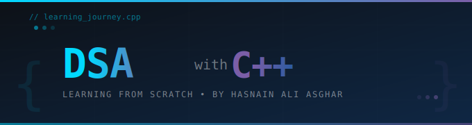

<div align="center">



</div>

<div align="center">

[](https://git.io/typing-svg)

</div>

<div align="center">


</div>

---

## 📌 About This Repository

> 💡 This repository is my **personal DSA learning journal** — built entirely from scratch using **C++**.
> Every file here represents a concept I've studied, understood, and implemented with my own hands.
> No copy-paste. No shortcuts. Just clean code and consistent effort.

```cpp
#include <iostream>
using namespace std;

int main() {
    string goal = "Master Data Structures & Algorithms in C++";
    string method = "Learn → Implement → Practice → Repeat";
    bool giveUp = false; // never.

    cout << "Author  : Hasnain Ali Asghar" << endl;
    cout << "Mission : " << goal << endl;
    cout << "Method  : " << method << endl;
    cout << "Status  : In Progress 🔥" << endl;

    return 0;
}
```

---

## 🗺️ Learning Roadmap

```
DSA-with-CPP/
│
├── 📁 01-Basics/              ← C++ fundamentals for DSA
├── 📁 02-Arrays/              ← Static & Dynamic Arrays
├── 📁 03-Linked-Lists/        ← Singly, Doubly, Circular
├── 📁 04-Stacks/              ← Stack using Array & Linked List
├── 📁 05-Queues/              ← Queue, Deque, Priority Queue
├── 📁 06-Recursion/           ← Base cases, Backtracking
├── 📁 07-Searching/           ← Linear, Binary Search
├── 📁 08-Sorting/             ← Bubble, Merge, Quick, Heap Sort
├── 📁 09-Trees/               ← Binary Tree, BST, AVL
├── 📁 10-Graphs/              ← BFS, DFS, Dijkstra
├── 📁 11-Hashing/             ← Hash Maps, Collision Handling
└── 📁 12-Dynamic-Programming/ ← Memoization, Tabulation
```

---

## 📚 Topics Coverage

<div align="center">

| # | Topic | Status | Difficulty |
|---|-------|--------|------------|
| 01 | **C++ Basics for DSA** | 🟡 In Progress | ⭐ Beginner |
| 02 | **Arrays** | ⬜ Not Started | ⭐ Beginner |
| 03 | **Linked Lists** | 🟡 In Progress | ⭐⭐ Easy |
| 04 | **Stacks** | ⬜ Not Started | ⭐⭐ Easy |
| 05 | **Queues** | ⬜ Not Started | ⭐⭐ Easy |
| 06 | **Recursion** | ⬜ Not Started | ⭐⭐⭐ Medium |
| 07 | **Searching** | ⬜ Not Started | ⭐⭐ Easy |
| 08 | **Sorting** | ⬜ Not Started | ⭐⭐⭐ Medium |
| 09 | **Trees** | ⬜ Not Started | ⭐⭐⭐ Medium |
| 10 | **Graphs** | ⬜ Not Started | ⭐⭐⭐⭐ Hard |
| 11 | **Hashing** | ⬜ Not Started | ⭐⭐⭐ Medium |
| 12 | **Dynamic Programming** | ⬜ Not Started | ⭐⭐⭐⭐⭐ Expert |

</div>

> 🟢 Done &nbsp;&nbsp; 🟡 In Progress &nbsp;&nbsp; ⬜ Not Started

---

## 🛠️ Tech & Tools

<div align="center">


</div>

---

## 📂 Folder Structure

Each topic folder follows this pattern:

```
📁 Topic-Name/
│
├── 📄 README.md         ← Concept explanation & notes
├── 📄 basics.cpp        ← Core implementation
├── 📄 problems.cpp      ← Practice problems
└── 📄 notes.md          ← Key takeaways & tips
```

---

## 💡 Why I'm Building This

- 🎯 To build a **strong foundation** in computer science fundamentals
- 🧠 To **think algorithmically** and solve problems efficiently
- 📈 To **prepare for technical interviews** and competitive programming
- 🔨 To **write better, optimized code** in every project I build

---

## 📈 Progress Tracker

```
Overall Progress:
█░░░░░░░░░░░░░░░░░░░  5% — Just getting started!

Arrays:          ░░░░░░░░░░  0%
Linked Lists:    █░░░░░░░░░  5%
Stacks:          ░░░░░░░░░░  0%
Trees:           ░░░░░░░░░░  0%
Graphs:          ░░░░░░░░░░  0%
DP:              ░░░░░░░░░░  0%
```
> 📝 *This section will be updated as I complete each topic!*

---

## 🤝 Connect With Me

<div align="center">

[](https://www.linkedin.com/in/hasnain-ali-asghar-2123222a6)
[](https://github.com/hasnainaliasghar)
[](mailto:hasnainaliasghar@outlook.com)

</div>

---

<div align="center">

### ⚡ *"The best way to learn DSA is to build it yourself — from scratch."*


</div>
